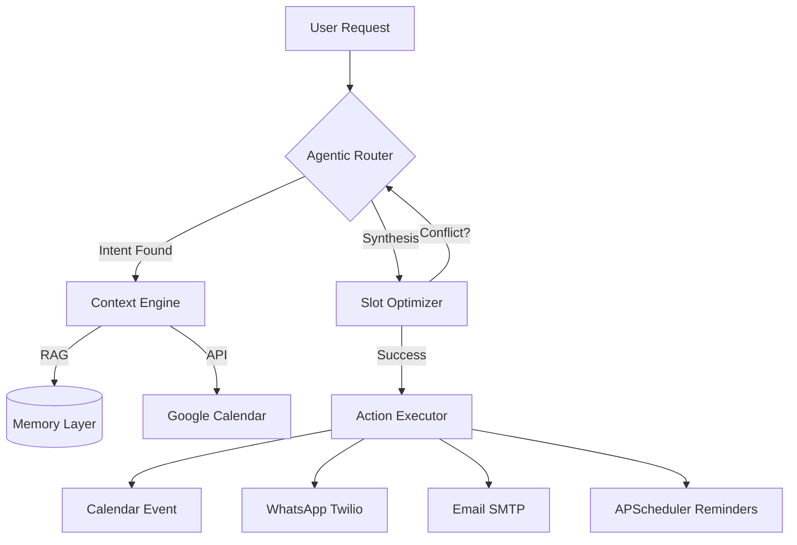

# 🤖 AI Meeting Scheduler — Enterprise-Grade Autonomous Assistant

[](https://www.python.org/downloads/)
[](https://github.com/langchain-ai/langgraph)
[](https://groq.com/)
[](https://opensource.org/licenses/MIT)

An advanced, multi-agent autonomous scheduling system designed for seamless calendar orchestration. This project leverages state-of-the-art Generative AI to transform natural language requests into production-ready calendar events, complete with automated multi-channel notifications and context-aware memory.

---

## 🌟 Executive Summary

Traditional scheduling tools require manual input and rigid forms. This agentic personal assistant utilizes **LangGraph** to maintain a stateful, cyclical reasoning loop, allowing it to:
- **Parse Intent**: Extract complex scheduling requirements from raw text.
- **Analyze Availability**: Cross-reference Google Calendar free/busy windows.
- **Enforce Preferences**: Apply saved user behavior patterns (e.g., "no meetings before 10 AM").
- **Deliver Confirmations**: Execute immediate notification delivery via WhatsApp and Email.

## 🧠 Advanced Agentic Architecture

The system is built on a modular **LangGraph** orchestrator, ensuring predictable execution flows and robust error recovery.



### Key Engineering Highlights:
- **Stateful Memory**: Utilizes a persistent memory layer to store and retrieve user scheduling preferences for hyper-personalized output.
- **Autonomous Reminders**: Integrated **APScheduler** background service for 24-hour and 10-minute automated notification triggers.
- **Graceful Degradation**: Production-hardened with circuit-breaker patterns for external APIs (Calendar, Database, Messaging).

---

## 🛠️ Technology Stack

| Component | Technology | Role |
|-----------|------------|------|
| **AI Orchestration** | [LangGraph](https://github.com/langchain-ai/langgraph) | Stateful multi-agent workflow |
| **LLM Provider** | [Groq (LLaMA 3.3 70B)](https://groq.com/) | Ultra-fast reasoning & function calling |
| **API Framework** | [FastAPI](https://fastapi.tiangolo.com/) | High-performance async backend |
| **Frontend** | Vanilla JS / Glassmorphism CSS | Visual dashboard & metrics |
| **Database** | PostgreSQL / SQLAlchemy | Persistent state & user context |
| **Integrations** | Google Calendar v3, Twilio, SMTP | External service orchestration |

---

## 🚀 Production Hardening

This project is engineered for more than just a demonstration. It includes professional-grade stability features:
- **Thread-Safe I/O**: High-latency Twilio calls are offloaded to optimized thread pools via `anyio`.
- **Diagnostic Dashboard**: Real-time health monitoring and sync status for all internal systems.
- **Naive UTC Synchronization**: Robust timezone handling to prevent scheduling drift across global environments.
- **Detailed Telemetry**: Structured logging for rapid debugging of communication failures (WhatsApp/Email).

---

## ⚡ Quick Start

### 1. Environment Preparation
```bash
# Clone the repository
git clone https://github.com/MahadevJagtap/-ai-meeting-scheduler.git
cd ai-meeting-scheduler

# Initialize virtual environment
python -m venv venv
source venv/bin/activate  # Or venv\Scripts\activate on Windows

# Install dependencies
pip install -r requirements.txt
```

### 2. Configuration
Create a `.env` file based on the provided logic. Key requirements:
- `GROQ_API_KEY`: For LLaMA 3.3 reasoning.
- `DATABASE_URL`: Async PostgreSQL connection string.
- `TWILIO_ACCOUNT_SID`: For WhatsApp notifications.
- `GOOGLE_CALENDAR_CREDENTIALS_JSON`: Inline JSON for cloud authentication.

### 3. Execution
```bash
uvicorn app.main:app --host 0.0.0.0 --port 8000
```

---

## 📈 Dashboard Features

The modern Glassmorphism frontend provides critical observability:
- **System Health**: Sidebar indicators for service status.
- **Scheduled Meetings**: Live metrics for agent productivity.
- **Upcoming Feed**: Real-time sync with Google Calendar.
- **Personal Context**: Visual count of active scheduling rules.

